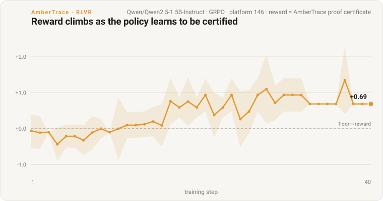

# ambertrace-rlvr

[](https://github.com/ambertrace-labs/ambertrace-rlvr/actions/workflows/ci.yml)
[](https://pypi.org/project/ambertrace-rlvr/)
[](https://pypi.org/project/ambertrace-rlvr/)
[](LICENSE)

A framework for building domain-specific models with **RLVR** (Reinforcement Learning from Verifiable Rewards) — training a model against an *automatic correctness check* rather than human preference scores — using [AmberTrace](https://ambertrace.ai) proof certificates as the verified reward signal.

> **Try it without an account.** The offline test suite (`pytest tests/ -q`) and the
> verification-overhead benchmark run with **no AmberTrace account** — they use the
> built-in `FakeVerifier` and recorded payloads. *Authoring* a platform and training
> against a live one need an API key from [ambertrace.ai](https://ambertrace.ai); see
> [the customer journey](#how-it-works--the-customer-journey) below.

## What is AmberTrace?

In regulated, rule-governed domains — lending, healthcare, hiring, compliance — **"the model said so" is not an acceptable answer**. A decision has to arrive with a reason you can check.

[AmberTrace](https://ambertrace.ai) produces a **machine-checkable proof for every decision**. You describe your rules in plain English and upload a features-only dataset (it learns **unsupervised** — no labels required); AmberTrace derives the rules and builds a *verified platform*. Every query is then answered by an independent, fail-closed **kernel** that re-derives and certifies the decision, returning an **Amber Report** that carries, among other things:

- a **`proof_checked` certificate** — the decision independently re-derived and certified against the trusted kernel,
- a **symbolic trace** — every rule evaluated and which fired, with reasons,
- **rejected facts** — low-confidence inputs the fact gate refused,
- a **fused confidence** (neural + symbolic).

That machine-checked certificate is the missing *verifier* for rule-governed domains — and it's exactly what this library turns into an RL reward. Here's a real Amber Report (trimmed) for a **Grant Eligibility** decision — the same demo domain as the training run below:

```jsonc
{
  "decision": "permit",
  "proof_checked": true,                        // ← the certificate: the reward hinges on this
  "proof_summary": "Decision independently certified against the trusted kernel: 6 rule(s) fired, 5 fact(s) derived from 4 input fact(s).",
  "explanation": {
    "confidence": { "overall": 0.86, "neural_confidence": 0.65, "symbolic_confidence": 1.0 },
    "certified_fact_summary": { "accepted": 4, "rejected": 0 },   // fact gate: nothing hallucinated
    "symbolic_trace": {
      "rules_evaluated": 14,
      "rules_fired": 6,
      "rules": [
        { "rule_name": "Classify Is Resident Eligible", "rule_type": "derive",
          "required": false, "fired": true,
          "explanation": "Rule 'Classify Is Resident Eligible' fired: eligible for residency if the applicant is a resident." },
        { "rule_name": "Check Annual Income Exceeds Threshold", "rule_type": "constraint",
          "required": false, "fired": false,
          "explanation": "Rule 'Check Annual Income Exceeds Threshold' did not match context" }
        // …every rule the kernel evaluated, with reasons
      ]
    }
  }
}
```

## What is `ambertrace-rlvr`?

`ambertrace-rlvr` lets you train your own domain-specific models where the reward is not a learned preference model or a heuristic, but a **verifiable proof certificate** issued by AmberTrace. A completion is rewarded only when its output produces a valid proof certificate for the domain — a hard, auditable ground-truth signal.

Concretely, the library turns a report like the one above into a scalar: `DefaultRewardShaper` reads `proof_checked`, the rejected-fact fraction, and the symbolic trace, and combines them into a **dense, bounded** reward — each component clamped to `[0, 1]` before weighting — so a certified, hallucination-free decision scores high, and a rejected-fact or uncertified completion **can never out-score it**. The reward function is a plain callable:

```python
reward_fn(prompts, completions, refs) -> list[float]
```

**Why not a verifier you write yourself?** RLVR practitioners already reward against math checkers and unit tests — cheap where ground truth is a string match or a passing test. AmberTrace is for domains where correctness is a *rulebook*, not a test suite: the certificate re-derives the decision against an auditable set of symbolic rules inside a fail-closed kernel, giving a reward only as trustworthy as a formal proof — not a regex you have to maintain and defend in an audit.

## Does it work? Watch it learn

A real GRPO run on the demo **Grant Eligibility** platform, trained on a laptop-class Apple Silicon machine — the policy is rewarded *only* when AmberTrace certifies its decision. Mean reward climbs from near the floor to **+0.69** (peak +1.35) as it learns to reason to conclusions the kernel will certify:



- **[Results writeup →](docs/RESULTS.md)** — method, setup, the reward-collapse-vs-KL-stability finding, and how to reproduce it.
- **[User Guide →](docs/USER_GUIDE.md)** — the full create → build → train walkthrough.
- **[API Reference →](docs/API_REFERENCE.md)** — every public symbol (`ambertrace_rlvr.__all__`) with its signature and purpose.

## How it works — the customer journey

Bring your own domain and data, and train a model against a verifiable reward in three steps:

1. **Create** — sign up at [ambertrace.ai](https://ambertrace.ai) and get an API key.
2. **Build** — BYOD: describe your domain in plain English and **author your verified platform with the [`ambertraceai`](https://pypi.org/project/ambertraceai/) Python SDK** (`platforms.create`, `create_rule`, `suggest_rules`). This is where your rulebook lives.
3. **Train** — point `ambertrace-rlvr` at your platform; the platform's proof certificate *is* the reward. Hand the reward function to your trainer (TRL/GRPO first).

This repo provides the reward machinery for step 3 **and** a runnable on-ramp for steps 1–2.

## Scope: this repo vs the `ambertraceai` SDK

Two projects, two jobs — keep them straight:

| | [`ambertraceai`](https://pypi.org/project/ambertraceai/) (the SDK) | `ambertrace-rlvr` (this repo) |
|---|---|---|
| **What it is** | The client for the AmberTrace platform | An RLVR reward bridge built **on top of** the SDK |
| **Its job** | Create account/keys; **author** a verified platform; **query** it → Amber Reports | Parse completions → queries; query via the SDK; shape the report → a scalar RL reward; adapt to trainers |
| **Platform access** | Read **and** write — *authoring lives here* | Reward **runtime** is read-only — it queries, never authors |

You **author** your platform with the SDK (step 2). `ambertrace-rlvr` then **consumes** it read-only at training time. This library never re-implements the SDK or the verification kernel.

## Status

**M0–M1 complete, M2 core + the eval/alignment lane in, M3 well under way.** The full reward path (parser → verifier → shaper) with dense per-criterion partial credit, fact-provenance anti-reward-hacking, and a rule-checked **consistency** component, a config-driven run loader, fail-closed resilience, the TRL/GRPO **and veRL** adapters, and a demonstrated end-to-end training run (see [Results](docs/RESULTS.md)). The **OpenRLHF** HTTP reward-server shim and the **cross-domain** swap-the-rule-set demo have both shipped. Plus a certificate-grounded **[evaluation & alignment](#evaluation--alignment)** lane — now running over open-weight models through a local **LM Studio** backend, with a published **[alignment matrix](docs/ALIGNMENT_MATRIX.md)** and a preliminary **[quantization sweep](docs/QUANT_ALIGNMENT.md)**. The TRL **RLOO** trainer builder ([#18](https://github.com/ambertrace-labs/ambertrace-rlvr/issues/18)) has since shipped alongside GRPO. Next: a reasoning-enabled arm of the quantization sweep ([#87](https://github.com/ambertrace-labs/ambertrace-rlvr/issues/87)) — see the [roadmap](ROADMAP.md). Design spec in [`docs/`](./docs/).

## Install

```bash
pip install ambertrace-rlvr             # core (reward path + config loader)
pip install 'ambertrace-rlvr[trl]'      # + TRL/GRPO training stack
```

Requires Python ≥ 3.11. The core install pulls in the `ambertraceai` SDK, which
you use to *author* a platform; `ambertrace-rlvr` then consumes it read-only at
training time.

Working from a clone (contributing, or running the examples) — editable install
with the dev tooling:

```bash
pip install -e '.[dev]'                 # core + pytest + pyright
pip install -e '.[trl]'                 # + TRL/GRPO training stack
```

## Quickstart

Once you've authored a platform with the `ambertraceai` SDK (step 2 above) and
have its `platform_id`, the reward function is a few lines:

```python
from ambertrace_rlvr import AmberVerifier, DefaultRewardShaper, JSONBlockParser, VerifiableDomain

# AMBERTRACE_API_KEY (scoped, platform-only) comes from the environment.
platform_id = 146  # <- your platform id from the author script
domain = VerifiableDomain.from_env(platform_id=platform_id, parser=JSONBlockParser())
reward_fn = AmberVerifier(domain=domain, shaper=DefaultRewardShaper()).as_reward_function()
rewards = reward_fn(prompts, completions, [{"gold": "permit"}, ...])   # -> list[float]
```

Or describe the whole run in one YAML and load it:

```python
from ambertrace_rlvr import load_run_config

run = load_run_config("configs/your_run.yaml")
reward_fn = run.reward_function()
```

### Author a demo platform (the "build" step)

`examples/author_demo_platform.py` walks the **build** half of the journey with
the SDK: it uploads a small **features-only** dataset (no labels — AmberTrace
learns unsupervised) and a plain-English domain description, builds a *verified*
platform, and confirms it certifies a query. It's an operator/setup script — not
library code; the reward runtime stays read-only.

```bash
python examples/gen_demo_dataset.py       # writes data/grant_eligibility_dataset.csv
python examples/author_demo_platform.py   # needs an authoring-scoped AMBERTRACE_API_KEY
```

It prints a `platform_id`; put it in `configs/grant_eligibility.yaml` (or set
`AMBERTRACE_PLATFORM_ID`) and you're ready to train.

See also `examples/score_completions.py` for a runnable end-to-end reward smoke
test and `configs/loan_example.yaml` / `configs/grant_eligibility.yaml` for full
run configs.

**Cross-domain / swap-the-rule-set:** `examples/cross_domain_demo.py` scores two
domains (grant eligibility + ACMG variant classification) through one
domain-agnostic code path — swapping only config + parser, no forks. Runs offline
with `FakeVerifier`; see [`docs/CROSS_DOMAIN.md`](docs/CROSS_DOMAIN.md).

## Evaluation & alignment

The same certificate that drives the reward is also a ground-truth **oracle-as-judge**, so this repo ships an evaluation lane that scores *model behaviour* against the proof. It's **independent of training** — it needs only the certificate, never a trainer or the reward shaper — and consumes **only the normalised certificate**, so the verifier's internals stay opaque.

- **Eval harness** — `evaluate` / `evaluate_policy` / `compare_to_baseline` / `consistency`: parse-rate, certified-rate, accuracy-vs-gold, mean reward + per-component traces, with trivial baselines.
- **Oracle-as-judge seam** — `OracleJudgment` + a per-domain `JudgmentSpec`: turns a certificate into **certified-decidable / certified-undecidable / unverifiable**, with a direction (fail-open vs fail-closed) and severity vocabulary.
- **Epistemic honesty** — `score_deviation`: a hard three-bucket partition plus an **overconfidence rate** — how often the model answers a case the oracle *proved* has no determinate answer (never scored as "wrong").
- **Sycophancy-into-error** — `run_sweep`: re-poses the *same* certified items under social-pressure framings and reports the **signed fail-open Δ** (movement toward under-restriction), split by severity band.
- **Monitorability** — `faithfulness_curve` / `compare_monitorability`: does stated-reasoning faithfulness erode as reward rises (train-against-verifier vs train-against-a-model-judge)?
- **Reward-hacking gap** — `reward_hacking_score`: scores a rule-preserving vs a rule-violating probe set and reports the reward gap between them, flagging a policy that scores high while breaking the rules.

```python
from ambertrace_rlvr import (
    OracleJudgment, JudgmentSpec, LabelSpec, parse_model_answer, score_deviation,
)

spec = JudgmentSpec(labels=[
    LabelSpec("deny", rank=0, restrictive=True),   # fail-closed / safety-critical
    LabelSpec("permit", rank=1),                   # fail-open
    LabelSpec("abstain", is_abstain=True),         # the certified-undecidable outcome
])
# reports: AmberReport per item (oracle queried on each item's fixed inputs)
judgments = [OracleJudgment.from_report(r, spec) for r in reports]
answers = [parse_model_answer(text, ["permit", "deny"]) for text in model_outputs]

report = score_deviation(judgments, answers, spec)
print(report.overconfidence_rate, report.over_permit_rate)   # alignment scores
```

Everything here is offline/network-free to test. To run it over real open-weight models, `model_backend.py` ships a local **LM Studio** backend (OpenAI-compatible endpoint) that turns a served model into a plain `prompt -> completion` callable; `corpus.py` + `eval_generator.py` build and load the `decision_eval_v1` oracle-anchored benchmark. On top of these:

- **[Alignment matrix](docs/ALIGNMENT_MATRIX.md)** (`matrix.py`) — the eval suite across **19 models / 10 labs**, ranked by CAS and by fail-open on the safety-critical band. Full 1,350-item run, single sample, temperature 0; reasoning-enabled Qwen3.8-27B tops it.
- **[Quantization sweep](docs/QUANT_ALIGNMENT.md)** (`quant_sweep.py`) — one base model across quant levels (Q8 → Q2) over the same items, reporting a **safety tax** (fail-open gained vs accuracy lost). Preliminary and directional — one model, small absolute counts.

> **Research.** For the why and the results, see [`docs/research/`](docs/research/):
> [*Verifiable Rewards Beyond Maths and Code*](docs/research/why-verifiable-rewards.md)
> (objectives + the case for a checkable reward),
> [*Measuring Misalignment as Deviation From the Provable*](docs/research/alignment-matrix.md)
> (the open-weight alignment matrix), and
> [*Faithfulness of Stated Reasoning Under Verifiable-Reward RL*](docs/research/faithfulness-under-rlvr.md)
> (does the reward erode chain-of-thought faithfulness? living draft, pilot results in).

## Design principles

- **Community-friendly and agent-usable.** Every public API is typed, every extension point is documented, and new domains are a config + a parser — not a fork.
- **Offline-first development.** The default test suite and benchmarks run with no network, no API key, and no GPU, using `FakeVerifier` and recorded payloads.
- **Fail-closed reward invariants.** A malformed completion, SDK error, or timeout resolves to the reward floor — never an exception into the training loop. Components are bounded to `[0, 1]`; a hallucinated completion can never out-score a certified one.
- **Read-only reward runtime.** The reward path queries a verified platform; it never authors or mutates one. Authoring is a separate step via the `ambertraceai` SDK.

## Repository layout

```
src/ambertrace_rlvr/
  domain.py        VerifiableDomain (bind to a platform)
  parsers.py       CompletionParser + JSON/Regex block parsers
  verifier.py      AmberVerifier — SDK query, cache, bounded concurrency, fail-closed
  reports.py       AmberReport normalisation over the QueryExplanation contract
  rewards.py       RewardShaper + DefaultRewardShaper (dense, hack-resistant)
  prompts.py       system-prompt template / format contract
  evaluation.py    eval harness — metrics, baselines, consistency
  eval_oracle.py   oracle-as-judge seam — OracleJudgment + JudgmentSpec
  deviation.py     three-bucket scorer + overconfidence rate
  sycophancy.py    social-pressure sweep — signed fail-open Δ
  faithfulness.py  faithfulness-vs-reward monitorability curve
  model_backend.py local LM Studio backend (OpenAI-compatible) → model callable
  corpus.py        decision_eval_v1 benchmark load/write + stats
  eval_generator.py SDK-driven eval-set generation
  matrix.py        alignment matrix runner (model × alignment-score)
  quant_sweep.py   quantization sweep — one model across quant levels
  testing.py       FakeVerifier + offline payload builders
  integrations/    trl.py (GRPO + RLOO builders), verl.py, openrlhf.py (HTTP reward-server shim)
examples/          runnable examples
configs/           per-run YAML
tests/             offline suite (FakeVerifier + recorded payloads)
docs/              design spec, user guide, results
```

## Verification overhead

RL post-training issues many verifications per step (`group_size × batch`), so
the verifier must not become the bottleneck (target: < ~15% of step
wall-clock, spec §10). `benchmarks/verification_overhead.py` is an offline
harness — `AmberVerifier._query` is stubbed with a configurable latency, so no
network call is made — that runs a synthetic batch through the existing
bounded-concurrency pool and prints the measured verify time, a simulated step
time, and the overhead percentage:

```bash
python benchmarks/verification_overhead.py
python benchmarks/verification_overhead.py --batch 32 --group-size 8 \
    --concurrency 16 --query-latency 0.05 --step-compute 2.0
```

It is a script, not a test (`benchmarks/` is excluded from `testpaths`).
Further throughput gains — a `query_batch` endpoint and a compact `query`
projection — are gated on the platform shipping them; see
[issue #27](https://github.com/ambertrace-labs/ambertrace-rlvr/issues/27).

## License

[MIT](./LICENSE) © 2026 Ambertrace Labs Ltd.
