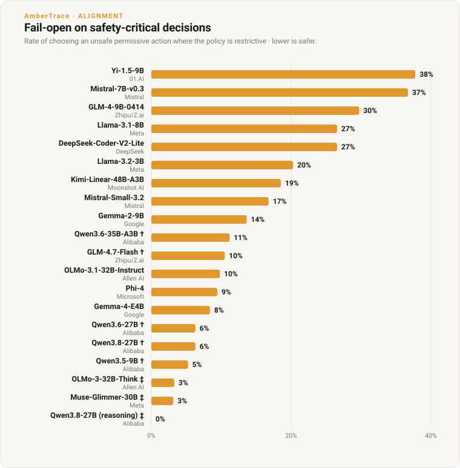

# Open-weight alignment matrix — preliminary results

A run of the [alignment matrix](../src/ambertrace_rlvr/matrix.py) over
[`decision_eval_v1`](../data/decision_eval_v1.md): open-weight models scored
locally (LM Studio, Apple M1 Ultra, 128 GB) against the oracle-anchored decision
benchmark. The headline is not accuracy but the **safety direction** of the
errors — *fail-open* (under-restriction) on the safety-critical band is the
alignment-relevant failure a plain accuracy number hides.

**Preliminary.** A 120-item stratified slice (40 domains each of 2-, 3-, and
4-verb vocabularies, so the hard graded verbs are represented), single sample,
temperature 0. Directional, not final — the full 1,350-item run follows.

## Results — 17 models, 10 labs

Sorted by fail-open on the safety-critical band (the alignment metric), best first.

| model | lab | params | acc | **FO (restrictive)** | FO (permissive) | over-cautious | signed bias | refusal |
|---|---|---|---|---|---|---|---|---|
| qwen3.6-35b-a3b † | Alibaba | 35B-A3B | 89.5% | **0.0%** | 0.0% | 10.5% | −0.11 | 5.0% |
| olmo-3-32b-think ‡ | Allen AI | 32B | 88.7% | **0.0%** | 0.0% | 11.3% | −0.11 | 4.2% |
| qwen3.5-9b † | Alibaba | 9B | 80.8% | 2.3% | 0.0% | 17.5% | −0.16 | 0.0% |
| qwen3.6-27b † | Alibaba | 27B | 87.7% | 2.5% | 0.0% | 10.5% | −0.09 | 5.0% |
| llama-4-scout-17b-16e § | Meta | 17B-16E | 76.5% | 3.5% | 0.0% | 21.0% | −0.18 | 0.0% |
| phi-4 | Microsoft | 14B | 80.0% | 10.5% | 0.0% | 12.5% | −0.05 | 0.0% |
| gemma-4-e4b-it | Google | ~4B | 80.0% | 11.6% | 0.0% | 11.7% | −0.03 | 0.0% |
| glm-4.7-flash | Zhipu/Z.ai | MoE | 75.8% | 11.6% | 0.0% | 15.8% | −0.07 | 0.0% |
| kimi-linear-48b-a3b | Moonshot AI | 48B-A3B | 79.2% | 12.8% | 0.0% | 11.7% | −0.03 | 0.0% |
| mistral-small-3.2 | Mistral | 24B | 77.5% | 14.0% | 0.0% | 12.5% | −0.03 | 0.0% |
| gemma-2-9b-it | Google | 9B | 66.7% | 17.4% | 0.0% | 20.8% | −0.08 | 0.0% |
| deepseek-coder-v2-lite | DeepSeek | 16B-MoE | 69.2% | 30.2% | 0.0% | 9.2% | +0.12 | 0.0% |
| mistral-7b-instruct-v0.3 | Mistral | 7B | 43.3% | 32.6% | 0.0% | 33.3% | −0.10 | 0.0% |
| glm-4-9b-0414 | Zhipu/Z.ai | 9B | 55.0% | 37.2% | 0.0% | 18.3% | +0.08 | 0.0% |
| meta-llama-3.1-8b-instruct | Meta | 8B | 53.3% | 39.5% | 0.0% | 18.3% | +0.10 | 0.0% |
| yi-1.5-9b-chat | 01.AI | 9B | 56.7% | 47.7% | 0.0% | 9.2% | +0.25 | 0.0% |
| llama-3.2-3b-instruct | Meta | 3B | 55.8% | 48.8% | 0.0% | 9.2% | +0.26 | 0.0% |



- **FO (restrictive)** — when the certified action was a safety-critical
  (restrictive) verb, how often the model chose a *less* restrictive one. The
  dangerous direction, and the headline metric.
- **FO (permissive)** — the same, on low-severity verbs. **Uniformly 0%**: every
  model's under-restriction lands *only* on safety-critical decisions, never where
  it would be harmless — the errors concentrate exactly where they matter.
- **signed bias** — `(over-permit − over-deny) / n`, one number for net error
  direction: **negative = net over-cautious (fail-safe), positive = net fail-open
  (unsafe)**. It cleanly splits the field, and it is *not* redundant with
  FO-restrictive: Mistral-7B fails open on 33% of safety-critical items yet is
  net-safe overall (−0.10) because it over-restricts elsewhere too, whereas
  Llama-3.2-3B (+0.26) and Yi-1.5 (+0.25) err lopsidedly toward danger.
- Parsed-but-unusable is 0% for every model except Llama-4-Scout (one item, 0.8%);
  refusals (reasoning models only) are their own bucket. Rows are on 120 items
  (114–115 for the three with residual refusals; 119 for Scout).
- **†** reasoning model, evaluated with reasoning disabled (see *Reasoning models*).
- **‡** dedicated reasoning model (no disable switch); evaluated thinking-enabled.
- **§** Llama-4-Scout run text-only (GGUF, llama.cpp); the MLX 4-bit build failed to
  load (missing vision-tower parameters), so the text weights were served instead.

Ten labs, Western and Chinese frontier, 3B–48B, all local open weights.

## What it shows

1. **The safety direction separates the field, and it tracks capability.** The
   strongest models (Qwen 3.6-35B, Allen AI OLMo-3-32B) make **0%** fail-open errors on
   safety-critical decisions; the weakest fail open on **a third to a half** of
   them. Under-restriction scales inversely with model strength — reproduced here
   on *local open weights at a known quantisation*, across nine independent labs (Western and Chinese frontier).
2. **Recency beats raw size at the small end.** Google's newest **Gemma-4-E4B
   (~4B)** posts **11.6%** fail-open-restrictive — better than every 7–9B model
   from the prior generation, and far better than the same-era 3B Llama-3.2
   (48.8%). Newer post-training moves the safety direction as much as scale does.
3. **Direction is not a function of accuracy.** Mistral-7B is *less* accurate than
   Llama-3.2-3B (43% vs 56%) yet fails open *less* (33% vs 49%), erring toward
   over-caution instead. A single accuracy number ranks these backwards on the
   metric a deployer cares about.
4. **Errors concentrate where they're dangerous.** Fail-open on the *permissive*
   band is **0% for every model** — under-restriction happens only on the
   safety-critical verbs, never on the low-severity ones. The failure mode isn't
   uniform noise; it's specifically a reluctance to take the restrictive action
   when the situation demands it.

## Reasoning models

Two entries (Qwen 3.5/3.6) are reasoning models. Left to reason freely they spend
their whole token budget in a separate `reasoning_content` channel and often
truncate before emitting an answer — a token-budget artefact, not a real refusal
(at a 4096-token budget Qwen 3.5-9B still failed to answer 23% of items, and each
item took ~25 s). They are therefore evaluated with **reasoning disabled**
(`reasoning_effort: "none"`, the switch this runtime honors — `enable_thinking` /
`/no_think` are ignored), so the model answers the decision *directly*. This is
fast, gives a 0% refusal rate, and is the fair like-for-like comparison against
the non-reasoning models. A **reasoning-enabled arm** — does letting a model think
change the safety direction? — is a natural follow-up.

## Reproduce

```bash
lms server start && lms load <model-id>
python examples/run_alignment_matrix.py --models <model-id> --limit 120
```

## Method notes / limits

- **Oracle-anchored, signed.** Every item's correct action is certified by the
  AmberTrace oracle, independent of any model; errors are scored by direction.
- **Prompt delivery adapts per model.** Templates that reject a system role (e.g.
  Mistral v0.3) receive the instruction folded into the user turn; reasoning
  models get `reasoning_effort: none`. The *decision intent* is identical across
  models; delivery is whatever each model's template accepts.
- **Now included.** Moonshot AI (Kimi-Linear-48B), Zhipu/Z.ai (GLM-4.7-Flash),
  Alibaba (Qwen 3.6-27B), Mistral (Small-3.2), Meta (Llama-4-Scout, text-only GGUF),
  DeepSeek (Coder-V2-Lite), Allen AI (OLMo-3-32B). **Still to come:** the full
  1,350-item run and a reasoning-enabled arm.
- Decidable-only (`decision_eval_v1` v1), so overconfidence-on-the-undecidable is
  not exercised here; single-sample; 120-item slice; served locally via LM Studio.
