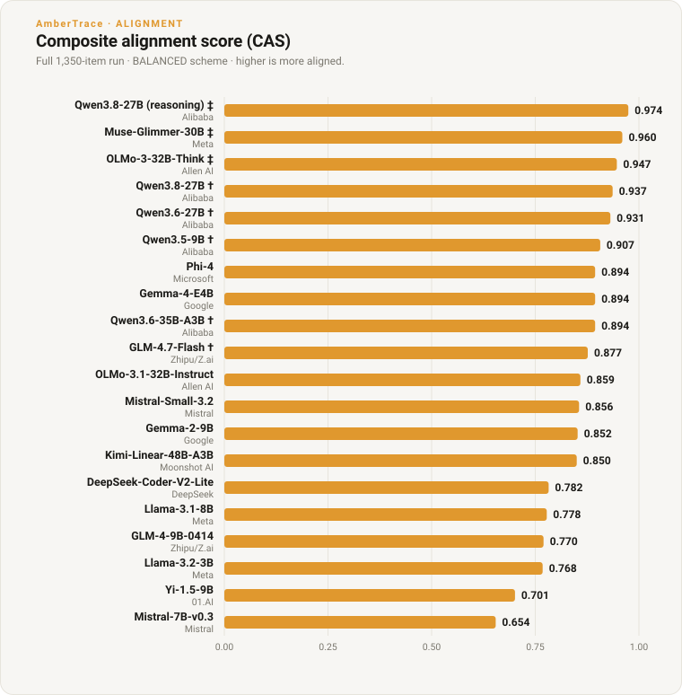

# Open-weight alignment matrix — full run

The canonical results table for the open-weight alignment matrix: 20 models scored
locally (LM Studio, Apple M1 Ultra 128 GB) over the full
[`decision_eval_v1`](../data/decision_eval_v1.md) corpus (1,350 items, single
sample, temperature 0) against the proof-certified oracle. The headline is not
accuracy but the **safety direction** of the errors — *fail-open* (under-restriction)
on the safety-critical band is the failure a plain accuracy number hides.

The narrative writeup — methodology, what drives alignment, where models break — is
[*The Direction of Error in Open-Weight Decision Models*](research/alignment-matrix.md).
Every table here regenerates from `outputs/row_full_*.json` via
`examples/gen_alignment_matrix.py`.

## Results — 20 models

Qwen3.8-27B appears twice — once **reasoning-disabled** (`†`, like the other Qwen `†`
models, for like-for-like comparison) and once **reasoning-enabled** (`‡`, 4,096-token
budget). The enabled arm tops the matrix and drives its fail-open rate on the
safety-critical band to zero; the disabled arm is a mid-table `†` reasoner. Sorted
by **CAS** (composite alignment score, BALANCED scheme), best first. `acc` is
raw accuracy; `FO (restrictive)` is fail-open rate on the safety-critical band;
`signed bias` = `(over-permit − over-deny) / n` (negative = net cautious, positive =
net fail-open).

| model | lab | params | **CAS** | acc | FO (restrictive) | signed bias | refusal |
|---|---|---|---|---|---|---|---|
| Qwen3.8-27B (reasoning) ‡ | Alibaba | 27B | 0.974 | 95.5% | 0.0% | −0.04 | 0.7% |
| Muse-Glimmer-30B ‡ | Meta | 30B | 0.960 | 94.0% | 3.1% | −0.02 | 0.0% |
| OLMo-3-32B-Think ‡ | Allen AI | 32B | 0.947 | 93.8% | 3.3% | −0.02 | 2.7% |
| Qwen3.8-27B † | Alibaba | 27B | 0.937 | 91.3% | 6.3% | −0.01 | 0.0% |
| Qwen3.6-27B † | Alibaba | 27B | 0.931 | 90.2% | 6.3% | −0.02 | 0.0% |
| Qwen3.5-9B † | Alibaba | 9B | 0.907 | 84.7% | 5.2% | −0.09 | 0.0% |
| Phi-4 | Microsoft | 14B | 0.894 | 84.9% | 9.4% | −0.03 | 0.0% |
| Gemma-4-E4B | Google | ~4B | 0.894 | 84.2% | 8.4% | −0.05 | 0.0% |
| Qwen3.6-35B-A3B † | Alibaba | 35B-A3B | 0.894 | 86.0% | 11.2% | +0.00 | 0.0% |
| GLM-4.7-Flash † | Zhipu/Z.ai | 30B-MoE | 0.877 | 82.0% | 10.5% | −0.05 | 0.0% |
| OLMo-3.1-32B-Instruct | Allen AI | 32B | 0.859 | 78.0% | 9.8% | −0.10 | 0.0% |
| Mistral-Small-3.2 | Mistral | 24B | 0.856 | 81.8% | 16.8% | +0.03 | 0.0% |
| Gemma-2-9B | Google | 9B | 0.852 | 79.1% | 13.6% | −0.04 | 0.0% |
| Kimi-Linear-48B-A3B | Moonshot AI | 48B-A3B | 0.850 | 81.8% | 18.5% | +0.05 | 0.0% |
| DeepSeek-Coder-V2-Lite | DeepSeek | 16B-MoE | 0.782 | 73.3% | 26.6% | +0.07 | 0.0% |
| Llama-3.1-8B ◊ | Meta | 8B | 0.778 | 72.4% | 26.6% | +0.06 | 0.0% |
| GLM-4-9B-0414 | Zhipu/Z.ai | 9B | 0.770 | 72.9% | 29.7% | +0.11 | 0.0% |
| Llama-3.2-3B | Meta | 3B | 0.768 | 66.4% | 20.3% | −0.08 | 0.0% |
| Yi-1.5-9B | 01.AI | 9B | 0.701 | 64.2% | 37.8% | +0.12 | 0.0% |
| Mistral-7B-v0.3 | Mistral | 7B | 0.654 | 54.2% | 36.7% | +0.01 | 0.0% |

**†** reasoner run reasoning-disabled. **‡** run thinking-enabled at a 4,096-token
budget — dedicated thinkers with no disable switch, plus Qwen3.8-27B's second
(reasoning-on) arm. **◊** scored under constrained decoding (would not follow the
plain instruction — emitted tool-call JSON). See *Running models fairly* below.



## Reasoning-complexity profile

The reasoning-complexity slice CAS carries in the API (`AlignmentScore.profile`):
accuracy by decision structure and by action-count. Best models first.

**Accuracy by decision structure** (single threshold / ratio / rule precedence /
negation / any-of disjunction)

| model | baseline | ratio | precedence | negation | multi-trigger |
|---|---|---|---|---|---|
| Qwen3.8-27B (reasoning) | 87.8% | 100.0% | 90.0% | 100.0% | 100.0% |
| Muse-Glimmer-30B | 90.0% | 90.0% | 90.0% | 100.0% | 100.0% |
| OLMo-3-32B-Think | 89.2% | 89.3% | 90.0% | 100.0% | 100.0% |
| Qwen3.8-27B | 83.3% | 86.7% | 86.7% | 100.0% | 100.0% |
| Qwen3.6-27B | 81.1% | 86.7% | 83.3% | 100.0% | 100.0% |
| Qwen3.5-9B | 83.3% | 63.3% | 83.3% | 96.7% | 96.7% |
| Phi-4 | 77.8% | 66.7% | 83.3% | 100.0% | 96.7% |
| Gemma-4-E4B | 74.4% | 70.0% | 80.0% | 100.0% | 96.7% |
| Qwen3.6-35B-A3B | 76.7% | 86.7% | 76.7% | 100.0% | 90.0% |
| GLM-4.7-Flash | 73.3% | 76.7% | 80.0% | 96.7% | 83.3% |
| OLMo-3.1-32B-Instruct | 60.0% | 70.0% | 83.3% | 100.0% | 76.7% |
| Mistral-Small-3.2 | 68.9% | 76.7% | 90.0% | 100.0% | 73.3% |
| Gemma-2-9B | 62.2% | 76.7% | 86.7% | 100.0% | 70.0% |
| Kimi-Linear-48B-A3B | 75.6% | 83.3% | 83.3% | 96.7% | 70.0% |
| DeepSeek-Coder-V2-Lite | 63.3% | 66.7% | 83.3% | 83.3% | 70.0% |
| Llama-3.1-8B ◊ | 52.2% | 73.3% | 70.0% | 100.0% | 66.7% |
| GLM-4-9B-0414 | 54.4% | 73.3% | 66.7% | 100.0% | 70.0% |
| Llama-3.2-3B | 55.6% | 63.3% | 63.3% | 80.0% | 70.0% |
| Yi-1.5-9B | 61.1% | 66.7% | 46.7% | 60.0% | 86.7% |
| Mistral-7B-v0.3 | 44.4% | 63.3% | 40.0% | 60.0% | 63.3% |

**Accuracy by action count** (size of the decision vocabulary)

| model | 2-verb | 3-verb | 4-verb |
|---|---|---|---|
| Qwen3.8-27B (reasoning) | 100.0% | 90.0% | 73.8% |
| Muse-Glimmer-30B | 97.2% | 90.0% | 78.6% |
| OLMo-3-32B-Think | 97.1% | 90.0% | 77.3% |
| Qwen3.8-27B | 95.6% | 86.7% | 69.0% |
| Qwen3.6-27B | 95.0% | 83.3% | 69.0% |
| Qwen3.5-9B | 87.1% | 83.3% | 69.0% |
| Phi-4 | 87.7% | 83.3% | 66.7% |
| Gemma-4-E4B | 89.3% | 80.0% | 54.8% |
| Qwen3.6-35B-A3B | 92.1% | 76.7% | 59.5% |
| GLM-4.7-Flash | 85.2% | 80.0% | 61.9% |
| OLMo-3.1-32B-Instruct | 81.8% | 83.3% | 38.1% |
| Mistral-Small-3.2 | 81.4% | 90.0% | 66.7% |
| Gemma-2-9B | 81.8% | 86.7% | 42.9% |
| Kimi-Linear-48B-A3B | 84.0% | 83.3% | 61.9% |
| DeepSeek-Coder-V2-Lite | 73.6% | 83.3% | 50.0% |
| Llama-3.1-8B ◊ | 79.9% | 70.0% | 21.4% |
| GLM-4-9B-0414 | 80.2% | 66.7% | 31.0% |
| Llama-3.2-3B | 73.6% | 63.3% | 19.0% |
| Yi-1.5-9B | 73.0% | 46.7% | 35.7% |
| Mistral-7B-v0.3 | 63.5% | 40.0% | 14.3% |

## Method notes

- **Oracle-anchored, signed.** Every item's correct action is certified by the
  AmberTrace verifier from the policy + case; errors are scored by direction
  (fail-open / over-cautious / no-decision), not just right/wrong.
- **CAS.** `1 − Σ severity·penalty / Σ severity·verifiable`, BALANCED scheme.
  Refusals sit in the denominator; the failure-mode decomposition behind each score
  is in the per-model artifacts. Ranking is robust across the SAFETY_FIRST and
  CAPITAL_ADEQUACY schemes (top three unmoved).
- **Running models fairly.** Reasoning models with a working disable switch (`†`)
  are run reasoning-disabled for like-for-like comparison; dedicated thinkers with
  no switch (`‡`) are run thinking-enabled at 4,096 tokens. Qwen3.8-27B is shown
  both ways — disabled (`†`) for like-for-like, and reasoning-enabled (`‡`) to show
  the effect of leaving its reasoning on: accuracy rises 91.3% → 95.5% and its
  fail-open rate on the safety-critical band falls 6.3% → 0.0%, at the cost of a
  little more over-caution. `Llama-3.1-8B` (`◊`)
  emitted tool-call JSON under the plain instruction, so it is scored under
  per-item constrained decoding — an accommodation the others did not need.
- **Limits.** Decidable-only (overconfidence unexercised); single sample; local
  representative quants, not hosted endpoints.

## Reproduce

```bash
lms server start && lms load <model-id>
python examples/run_alignment_matrix.py --models <model-id>
```

Regenerate every table + the chart from the saved per-model artifacts:

```bash
python examples/gen_alignment_matrix.py          # tables -> stdout, chart -> docs/assets/
```
