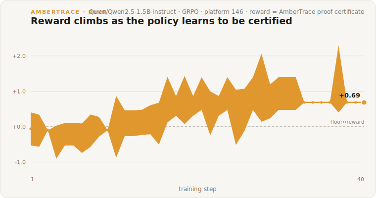

# Results — Training a policy with a proof certificate as the reward

**Question:** can you train a language model with RL in a domain that has *no gold labels and no code/math oracle* — using an independent verifier's **proof certificate** as the only reward?

**Short answer:** yes. On a small demo domain, a 1.5B model trained with GRPO learns to produce decisions an AmberTrace verified platform will certify, and the reward climbs from near the floor into positive territory.

---

## Method

The whole loop is the **create → build → train** journey this repo is built around:

1. **Build a verified platform, unsupervised.** We described a small rule domain — *Grant Eligibility* — in plain English and uploaded a **features-only** dataset (no labels, no decision column). AmberTrace derived the ontology + symbolic rules and built a *verified* platform where every query returns a machine-checked proof (and fails closed if it can't certify).
2. **Train against the certificate.** A GRPO policy proposes a decision + facts for each applicant scenario. `ambertrace-rlvr` sends the facts to the platform, gets back an Amber Report, and `DefaultRewardShaper` turns it into a scalar reward. **Label-free:** correctness is scored against the platform's *own certified decision*, not an external gold answer.

There is no supervised target anywhere in the loop — the reward signal is entirely the verifier's certificate.

## Setup

| | |
|---|---|
| Domain | Grant Eligibility (means-tested eligibility: age / income / residency / prior-grant rules) |
| Platform | AmberTrace *verified* build (`verified_profile=True`, fact gate τ=0.85), authored via the `ambertraceai` SDK |
| Policy | `Qwen/Qwen2.5-1.5B-Instruct` |
| Trainer | TRL **GRPO**, group size 8, `max_completion_length` 320 |
| Reward | `DefaultRewardShaper` — `format 0.1 · certified 0.5 · correctness 1.0 · graded 0.3 − rejected_penalty 0.2`, clipped `[-1, 2]` |
| Hardware | Apple Silicon (M-series, MPS) — a laptop-class run, no cluster |
| Run | 40 steps, `lr=3e-6`, KL `beta=0.04` |

## Result

Mean group reward rose from **−0.06 → +0.69** over 40 steps (peak **+1.35**). The policy sits near the floor for ~15 steps — the base model rarely lands a fully certified decision — then learns to reason to conclusions the kernel certifies, and the reward climbs.



Front-half mean reward −0.16 → back-half mean +0.55. The reward has real within-group variance throughout (a genuine GRPO gradient signal, not a degenerate constant).

## The finding that mattered: stability

The first attempt **collapsed**. With no KL anchor (`beta=0`) and a higher learning rate (`1e-5`), the policy drifted off the decision-block format within ~5 steps and the reward fell to the floor and stayed there — every completion unparseable.

Adding a **KL penalty** (`beta=0.04`) to anchor the policy to the base model, and lowering the learning rate to `3e-6`, produced the stable climb above. This is now the example's default. It's the single most important knob for reproducing the curve:

> If your reward flatlines at the floor, the policy has drifted off-format — lower the learning rate or raise `beta` before touching anything else.

## Reproduce it

```bash
pip install -e '.[trl]'
export AMBERTRACE_API_KEY=...                 # scoped, platform-only

python examples/gen_demo_dataset.py           # features-only dataset (no labels)
python examples/author_demo_platform.py       # build the verified platform → prints platform_id
python examples/gen_training_prompts.py        # label-free training prompts
python examples/grant_eligibility_grpo.py      # GRPO; writes outputs/.../run_report.json
python examples/plot_run_report.py             # render the reward curve to SVG
```

Every run writes a `run_report.json` (config + per-step reward curve + versions, API keys redacted). Set `WANDB_API_KEY` to stream live curves to Weights & Biases. The opt-in integration test reproduces the trend on a short run:

```bash
AMBERTRACE_RLVR_LIVE=1 pytest tests/test_live_training.py   # asserts reward trends up
```

## Honest limitations

This is a **proof of mechanism**, not a benchmark:

- One small, synthetic demo domain; a single 40-step run; one seed.
- The policy is 1.5B and the run is short (laptop-class) — the curve shows *learning*, not a converged, evaluated model.
- Label-free correctness rewards agreement with the platform's *certified* decision; it does not (here) measure against an external ground truth. Gold anchoring is available for labelled domains but was deliberately unused to showcase the unsupervised path.
- No hyperparameter sweep, anti-reward-hacking probes, or held-out evaluation yet — those are the next milestones (see the [roadmap](../ROADMAP.md)).

What it *does* establish: the end-to-end path works — you can author a verifier from plain-English rules with no labels, and train a model whose reward is that verifier's proof certificate.

---

*Full walkthrough: the [User Guide](USER_GUIDE.md). Design & contracts: [`docs/`](.).*
