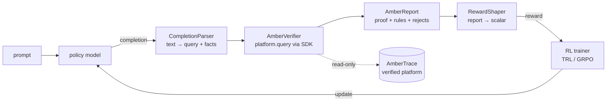

# User Guide — Training with Verifiable Rewards

**Teach a model to reason inside your rules, and reward it only when an independent verifier certifies it got there correctly.**

This guide walks the whole journey end-to-end: from a plain-English domain to a trained policy whose reward is a machine-checked **proof certificate**. It uses the runnable **Grant Eligibility** demo that ships in this repo.

---

## The idea in one picture

RLVR (Reinforcement Learning with Verifiable Rewards) works brilliantly where you have a cheap, automatic oracle — arithmetic, code execution. Most real decisions (lending, prescribing, compliance) have *rules* but no oracle. **AmberTrace is that oracle:** describe your rules in plain English, and its neurosymbolic kernel re-derives and *certifies* each decision. `ambertrace-rlvr` turns that certificate into a reward.



The library is a **thin bridge**: it never re-implements the verifier, and its reward runtime only ever *queries* your platform — it never authors or mutates it.

> **Scope:** you *author* your platform with the [`ambertraceai`](https://pypi.org/project/ambertraceai/) SDK; `ambertrace-rlvr` *consumes* it to produce rewards. See [the scope table in the README](../README.md#scope-this-repo-vs-the-ambertraceai-sdk).

---

## The journey: create → build → train

### 0. Install

```bash
pip install -e '.[trl]'      # training stack (torch, transformers, trl)
pip install -e '.[wandb]'    # optional: live experiment tracking
```

Set a **scoped, platform-only** API key in your environment (never commit it):

```bash
export AMBERTRACE_API_KEY=...     # or put it in .env
```

### 1. Create your account

Sign up at [ambertrace.ai](https://ambertrace.ai) and create an API key. That's it — you now have a platform to build on.

### 2. Build your verified platform (BYOD, **unsupervised**)

You bring two things: a **plain-English description** of your rules, and a **dataset of examples** — *features only, no labels*. AmberTrace learns unsupervised: it derives the ontology and symbolic rules from your description + data, then builds a *verified* platform where every query carries a machine-checked proof (and fails closed if it can't certify).

The demo does exactly this — see [`examples/author_demo_platform.py`](../examples/author_demo_platform.py):

```bash
python examples/gen_demo_dataset.py       # features-only dataset (no labels!)
python examples/author_demo_platform.py   # domain → upload → build_ontology → verified platform
```

Under the hood it calls the SDK: `domains.create(description=...)` → `datasets.upload(...)` (no `decision_column`) → `domains.build_ontology(...)` → `platforms.create(verified_profile=True)`. It prints a `platform_id` and verifies it certifies a known case:

```
[expect permit] decision='permit' proof_checked=True confidence=0.86 rules_fired=6
[expect deny]   decision='deny'   proof_checked=True confidence=0.86 rules_fired=5
```

Put that `platform_id` in your config.

### 3. Configure a run

A whole run is one YAML file — no hidden state ([`configs/grant_eligibility.yaml`](../configs/grant_eligibility.yaml)):

```yaml
domain:
  platform_id: 146                 # your authored platform
  query_template: "Assess this grant application: {facts}"
  parser: json_block
  parser_args: { answer_key: classification, facts_key: facts }
reward:
  shaper: default
  weights: { format: 0.1, certified: 0.5, correctness: 1.0, graded: 0.3, rejected_penalty: 0.2 }
  clip: [-1.0, 2.0]
training:
  framework: trl_grpo
  model: Qwen/Qwen2.5-1.5B-Instruct
  group_size: 8
```

### 4. Train

```bash
python examples/grant_eligibility_grpo.py            # real GRPO run
python examples/grant_eligibility_grpo.py --dry-run  # offline reward-wiring check (no GPU)
```

The policy proposes a decision + facts; the platform re-derives and certifies; the shaper turns the Amber Report into a reward; GRPO updates the policy. **Label-free** — the reward comes from the certificate, not from gold answers.

---

## How the reward is shaped

A binary "certified?" is too sparse and easy to game. `DefaultRewardShaper` composes several bounded components (each in `[0, 1]` before weighting), so partial progress is rewarded and hallucinated facts are penalised:

| Component | Signal | Why |
|-----------|--------|-----|
| `format` | completion parses into a valid decision block | bootstrap well-formed output |
| `certified` | `report.proof_checked` | the hard verifiable core |
| `correctness` | proposed answer vs gold **or** vs the platform's certified decision | task accuracy (label-free uses the certified decision) |
| `graded` | fraction of required rules correctly derived | dense partial credit |
| `rejected_penalty` | fraction of asserted facts the kernel rejected (subtracted) | discourage invented facts |

`total = Σ wᵢ · componentᵢ`, clipped to the configured range. **Invariants:** a rejected-fact or hallucinated completion can never out-score a clean certified one, and a malformed completion always returns the floor. The reward function is **fail-closed** — a parse error, SDK error, or timeout resolves to the floor, never an exception into your training loop.

---

## Reading the results

Every run writes a **run report** (`outputs/.../run_report.json`) with a config snapshot, per-step reward curve, and package versions (API keys redacted). With `WANDB_API_KEY` set, the same metrics stream to a [Weights & Biases](https://wandb.ai) dashboard for live, shareable curves.


*A real 40-step GRPO run on the Grant Eligibility platform (Qwen2.5-1.5B-Instruct, Apple Silicon/MPS). Mean group reward rose from **−0.06 → +0.69** (peak +1.35).*

The reward hovers near the floor for the first ~15 steps — the base model rarely produces a fully certified decision — then climbs as the policy learns to (a) emit well-formed decisions and (b) reason to conclusions the kernel will certify.

**Stability matters (a real lesson from building this).** With no KL anchor (`beta=0`) and too high a learning rate, the policy drifts off-format within a few steps and the reward *collapses* to the floor. The example therefore defaults to a KL penalty (`beta=0.04`) and a modest learning rate (`lr=3e-6` for the run above). If your reward flatlines at the floor, lower the learning rate or raise `beta` before anything else.

---

## Troubleshooting

- **Segfault on model load (Apple Silicon/MPS):** transformers 5.x materializes weights across threads and concurrent Metal copies can crash. The demo forces single-threaded loading (`core_model_loading.GLOBAL_WORKERS = 1`); do the same in your own scripts on macOS.
- **All rewards stuck at the floor:** your completions are probably being truncated before the `</decision>` block — raise `--max-completion-length`.
- **Tests must stay offline:** the default suite uses `FakeVerifier` and recorded payloads. The real training test is opt-in and network-gated (see below).

---

## Verifying it actually learns

A network-gated integration test runs a short real GRPO loop and asserts the reward trends up:

```bash
AMBERTRACE_RLVR_LIVE=1 pytest tests/test_live_training.py
```

It's skipped by default so the offline suite stays deterministic and CI-safe.

---

## Where to go next

- Swap the domain: point `configs/*.yaml` at your own platform and parser — no code changes.
- Tune the reward: adjust component weights, or subclass `RewardShaper` for per-criterion graded credit.
- Scale up: veRL / OpenRLHF adapters are on the [roadmap](../ROADMAP.md).
