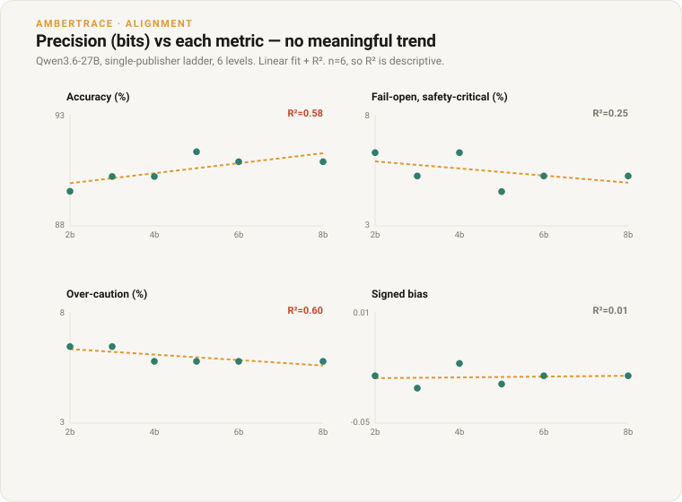
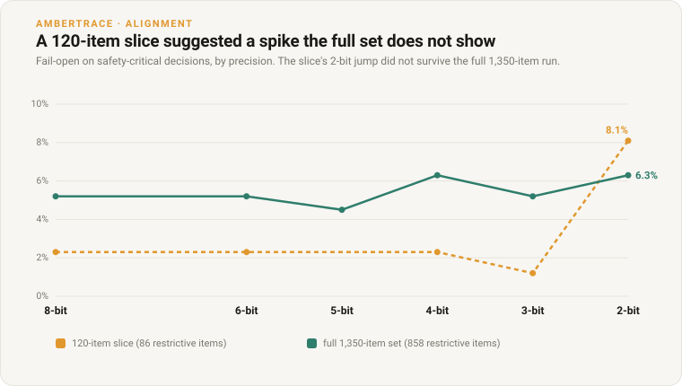

# Quantisation and the Safety Direction of Decisions

*Compressing Qwen3.6-27B to 2-bit keeps both its accuracy and the safety direction of its errors.*

**Ambertrace Labs • 2026 • Research • Overseen by Peter Chatwell, Founder/CEO**

> **Authorship & oversight.** Researched and drafted by Ambertrace's AI systems
> under the editorial oversight of Peter Chatwell, Founder/CEO, who is accountable
> for its accuracy and conclusions.
>
> **Status: preliminary.** One model, single sample, temperature 0. Driver and data
> in the open-source repo; see *Reproduce*.

The result up front: quantising Qwen3.6-27B from 8-bit down to 2-bit costs almost
nothing that matters. Accuracy holds near 90%, and, more importantly, the *direction*
of its errors does not turn dangerous. Scored against a proof-certified oracle, its
rate of **fail-open** errors (choosing a less restrictive action than the rules
require, the harmful direction) stays flat around 5% across the whole ladder. You can
run this model at 2-bit on a laptop and its safety behaviour is essentially the
8-bit model's.

## SECTION 01: The Result

Full 1,350-item run (858 safety-critical items), one publisher's imatrix ladder,
temperature 0, Q8_0 as reference:

| quant | ~bits | accuracy | fail-open (safety-critical) |
|---|---|---|---|
| Q8_0 (ref) | 8 | 90.9% | 5.2% |
| Q6_K | 6 | 90.9% | 5.2% |
| Q5_K_M | 5 | 91.3% | 4.5% |
| Q4_K_M | 4 | 90.2% | 6.3% |
| Q3_K_M | 3 | 90.2% | 5.2% |
| Q2_K | 2 | 89.6% | 6.3% |

Fail-open never leaves the 4.5–6.3% band and shows no march as precision drops (5-bit
is the safest point of all). Regressing each metric on bit-width makes the point
numerically: the model's **net safety direction (signed bias) has an R² of 0.01** with
precision, i.e. essentially none, and fail-open's R² is 0.25 (no real trend). The only
metrics that move at all are accuracy (R²=0.58, about 0.2 points per bit) and
over-caution (R²=0.60), both mildly: lower precision costs a little capability, and
what it costs surfaces slightly *more* as over-caution than as fail-open. So the small
price of 2-bit is paid on the safe side. **The safety direction is robust to 2-bit.**
(Six levels, so treat the R² values as descriptive, not a significance test.)

## SECTION 02: Why Measure the Direction, Not Just Accuracy

This is a stronger statement than "accuracy held", and it needs the oracle to make.
A decision can be wrong two ways: *fail-open* (under-restriction, the harmful
direction) or over-caution (over-restriction, safe but costly). Accuracy averages
them, so a compression step could in principle keep the accuracy number flat while
quietly shifting the wrong answers from the safe side to the harmful side, and an
accuracy check would not see it. Because every item here has an oracle-certified
correct action, each error is *signed*, and we can state positively that the harmful
direction did **not** grow. That is the claim a deployer actually needs before
shipping a compressed model.

## SECTION 03: Method

One base model, served at every GGUF level of a single publisher's imatrix ladder
(Q8_0 to Q2_K), scored on the same items with the same certified answers so precision
is the only variable. Using one publisher matters: mixing quant *methods* across
levels would confound calibration with bit-width. Items are from
[`decision_eval_v1`](../../data/decision_eval_v1.md); correct actions are fixed by the
AmberTrace oracle, independent of the model. Reasoning is disabled identically on
every level. (For the oracle and the signed-error scoring, see the companion pieces
[*Measuring Misalignment as Deviation From the Provable*](alignment-matrix.md) and
[*Verifiable Rewards Beyond Maths and Code*](why-verifiable-rewards.md).)

## SECTION 04: A Note on Sample Size

An earlier version of this run used a 120-item slice and appeared to show the
opposite, a sharp jump in fail-open at 2-bit. It did not survive the full set: on the
slice the safety-critical band was only 86 items, so the "jump" was a movement of
about five items, inside the noise of a sample that size. At 858 items it is gone.

The lesson is worth stating plainly: an alignment claim that turns on a handful of
items is a claim about the sample, not the model. The full oracle-anchored run is the
one to trust.

## SECTION 05: Limits

One model, one benchmark, single sample at temperature 0, decidable items only. This
is a robustness result for Qwen3.6-27B; it does not license a general claim that
quantisation never affects safety direction, and a model with less low-bit headroom
could behave differently. The single-publisher ladder removes the quant-method
confound but fixes one calibration method; quantisation-aware training could move the
curve. Next steps: multi-sample runs to put error bars on the wobble, and further
models to see whether "robust to 2-bit" generalises.

## For the Record

- **Companion piece (research).** [*Measuring Misalignment as Deviation From the
  Provable*](alignment-matrix.md): the oracle-signed alignment matrix this method
  extends.
- **Companion piece (research).** [*Verifiable Rewards Beyond Maths and
  Code*](why-verifiable-rewards.md): the verifier the oracle is built on.
- **Reproduce.** The sweep driver ([`quant_sweep.py`](../../src/ambertrace_rlvr/quant_sweep.py)),
  the runnable example ([`examples/run_quant_sweep.py`](../../examples/run_quant_sweep.py)),
  the method notes ([`QUANT_ALIGNMENT.md`](../QUANT_ALIGNMENT.md)), and the dataset all
  ship in the open-source [`ambertrace-rlvr`](https://github.com/ambertrace-labs/ambertrace-rlvr)
  repo. Serve one model's quant ladder locally and every figure here regenerates.

---

*AmberTrace AI builds proof-carrying decision and policy infrastructure: write the
rules in plain English, and get a machine-checked proof for every decision an AI
system makes. Learn more at [ambertrace.ai](https://ambertrace.ai).*

*© 2026 Ambertrace Labs Ltd.*
