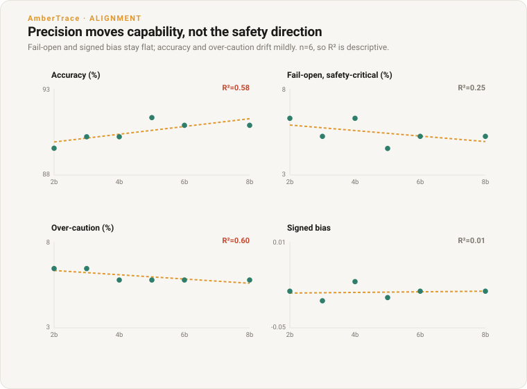

# Quantisation and the Safety Direction of Decisions

*How Qwen3.6-27B's decision accuracy and the direction of its errors change across a six-level quantisation ladder, measured against a proof-certified oracle.*

**Ambertrace Labs • 2026 • Research • Overseen by Peter Chatwell, Founder/CEO**

> **Authorship & oversight.** Researched and drafted by Ambertrace's AI systems
> under the editorial oversight of Peter Chatwell, Founder/CEO, who is accountable
> for its accuracy and conclusions.
>
> **Status: preliminary.** One model, single sample, temperature 0, 1,350 decidable
> items. Six data points per trend, so regressions are descriptive, not inferential.

Qwen3.6-27B served at six GGUF quantisation levels from one publisher's imatrix
ladder (Q8_0 to Q2_K), scored on the same 1,350 items (858 on the safety-critical
band) with oracle-certified correct actions. Reasoning disabled identically at every
level, so precision is the only variable. Three findings, in order of signal strength.

## Finding 1: fail-open is concentrated in one reasoning type

The model's fail-open errors (choosing a less restrictive action than the rules
require) are not spread across rule types. They sit almost entirely on **ratio**
rules, a threshold on a computed ratio such as "the monthly payment must not exceed
80% of income". Fail-open rate on the safety-critical band, by rule structure, at each
precision level:

| rule structure | n | 8-bit | 6-bit | 5-bit | 4-bit | 3-bit | 2-bit |
|---|---|---|---|---|---|---|---|
| **ratio** | 171 | 15.8% | 15.8% | 15.8% | **21.1%** | 15.8% | 15.8% |
| precedence | 180 | 5.0% | 5.0% | 5.0% | 5.0% | 5.0% | 0.0% |
| baseline threshold | 192 | 4.7% | 4.7% | 1.6% | 4.7% | 4.7% | 9.4% |
| multi-trigger disjunction | 180 | 0.0% | 0.0% | 0.0% | 0.0% | 0.0% | 5.0% |
| negation | 135 | 0.0% | 0.0% | 0.0% | 0.0% | 0.0% | 0.0% |

Ratio rules draw roughly three times the fail-open of any other structure and about
16% in absolute terms, at every precision including full 8-bit. Logical composition is
the opposite story: the model never fails open on a negation, and only does so on a
disjunction at 2-bit. The weakness is **quantitative** reasoning (apply an arithmetic
threshold), not logical reasoning, and it is a property of the base model that
quantisation neither creates nor removes.

## Finding 2: the aggregate safety direction does not track precision

Across the ladder, the net direction of the errors is flat while accuracy declines
slightly:

| bits | accuracy | fail-open (safety-critical) | over-caution | signed bias |
|---|---|---|---|---|
| 8 | 90.9% | 5.2% | 5.8% | −0.024 |
| 6 | 90.9% | 5.2% | 5.8% | −0.024 |
| 5 | 91.3% | 4.5% | 5.8% | −0.029 |
| 4 | 90.2% | 6.3% | 5.8% | −0.018 |
| 3 | 90.2% | 5.2% | 6.4% | −0.031 |
| 2 | 89.6% | 6.3% | 6.4% | −0.024 |

Regressing each column on bit-width (signed bias = `(over-permit − over-deny)/n`,
negative = net over-cautious):

| metric | R² | slope per bit |
|---|---|---|
| signed bias | 0.01 | +0.0002 |
| fail-open (safety-critical) | 0.25 | −0.16 pt |
| accuracy | 0.58 | +0.23 pt |
| over-caution | 0.60 | −0.12 pt |

Signed bias is effectively unrelated to precision (R²=0.01); the model stays net
over-cautious by the same small margin at 2-bit as at 8-bit. Fail-open shows no
reliable trend (R²=0.25). The two columns that do move are accuracy and over-caution,
both mildly: dropping from 8-bit to 2-bit costs about 1.3 points of accuracy
(90.9%→89.6%), and the lost capability surfaces marginally more as over-caution than
as fail-open. Quantisation to 2-bit therefore trades a little accuracy without moving
the net safety direction. It does not make this model more dangerous; it also does not
fix the ratio weakness in Finding 1, which is precision-independent.

## Finding 3: at 2-bit the failures redistribute

The near-stable total at 2-bit hides a reshuffle underneath it. The safety-critical
fail-open count rises only from 45 to 54 items (5.2%→6.3%), but the composition of
those failures changes. Within the rule-structure cut, baseline fail-open doubles
(9→18 items) and disjunction appears (0→9), offset by precedence falling to zero
(9→0), with ratio and negation unchanged. The action-count cut is a different view of
the same shift: four-action decisions jump (3→12 of 102, i.e. 2.9%→11.8%) while
three-action decisions fall to zero (9→0). Each of these moves is about nine items on
a subset of 100–190, small enough to be noise, so the defensible reading is only that
2-bit changes *where* the model fails at least as much as *how much*. An earlier
120-item pilot caught the four-action jump in isolation and over-weighted it into an
apparent 2-bit "safety tax" that the full run does not support.

## Method

Single base model, one publisher's imatrix GGUF ladder (Q8_0/Q6_K/Q5_K_M/Q4_K_M/
Q3_K_M/Q2_K), so calibration method is held constant and bit-width is the only
variable (an earlier mixed-publisher ladder confounded the two). Items from
[`decision_eval_v1`](../../data/decision_eval_v1.md); every correct action is certified
by the AmberTrace oracle independent of the model, so each error is signed as fail-open
or over-caution. Full run: 1,350 items, 858 on the safety-critical band.

Qwen3.6 is a hybrid reasoning model, so the decoding setup is held fixed across the
ladder to keep precision the only variable: `reasoning_effort: "none"` (the switch this
runtime honours, which suppresses the private thinking trace so the model answers the
decision directly), the same system prompt, `max_tokens=512`, stop sequences, and
temperature 0, at every level. This matters because reasoning is a confounder that
could act unevenly across quant levels: left enabled, a model can spend its token
budget thinking and truncate before answering, and a more-degraded low-bit model might
do so more often, contaminating the comparison. Disabling it measures the model's
*direct* decision like-for-like. That it took hold uniformly is visible in the data:
every level parsed 1,350/1,350 with zero refusals. For the oracle and the signed-error
scoring, see [*Measuring Misalignment as Deviation From the
Provable*](alignment-matrix.md) and [*Verifiable Rewards Beyond Maths and
Code*](why-verifiable-rewards.md).

## Limits

One model, one benchmark, single sample at temperature 0, decidable items only. Six
precision levels means the regressions in Finding 2 and the redistributions in Finding
3 are descriptive, not significance-tested; multi-sample runs would put error bars on
both. The single-publisher ladder isolates bit-width but fixes one calibration method,
and quantisation-aware training could change the picture. Whether the ratio weakness
and the precision-insensitivity of the safety direction generalise beyond Qwen3.6-27B
is untested. Every result here is also conditional on the **no-reasoning regime**:
reasoning was disabled so precision stayed the only variable, so these findings do not
speak to how the model behaves, or how quantisation affects it, when it is allowed to
reason. The reasoning-enabled arm below answers that question.

---

## Reasoning-enabled arm

*Same August ladder (Q8_0 through Q2_K, same single-publisher imatrix quants), same
1,350 oracle-certified items, but with the model's thinking channel active.*

**Provenance note on Q2_K.** Between the no-reasoning and reasoning runs, bartowski
refreshed the Q2_K upload (same repo, updated GGUF). The reasoning-arm Q2_K was run
against the refreshed file. The five higher levels are identical uploads across both
arms. The Q2_K reasoning-arm numbers are therefore not a strict apples-to-apples
comparison at that level; the refresh is noted inline and the Q2_K point should be
read with that caveat.

### Finding 4: reasoning lifts accuracy and halves fail-open

| quant | arm | accuracy | fail-open (restr) | truncated | signed bias |
|---|---|---|---|---|---|
| Q8_0 | no-reasoning | 90.9% | 5.2% (45/858) | 0 | −0.024 |
| Q8_0 | reasoning | 94.0% | 3.1% (27/858) | 0 | −0.020 |
| Q6_K | no-reasoning | 90.9% | 5.2% (45/858) | 0 | −0.024 |
| Q6_K | reasoning | 94.0% | 3.2% (27/849) | 9 | −0.020 |
| Q4_K_M | no-reasoning | 90.2% | 6.3% (54/858) | 0 | −0.018 |
| Q4_K_M | reasoning | 93.8% | 2.5% (21/857) | 0 | −0.031 |
| Q3_K_M | no-reasoning | 90.2% | 5.2% (45/858) | 0 | −0.031 |
| Q3_K_M | reasoning | 94.7% | 2.1% (18/858) | 0 | −0.027 |
| Q2_K | no-reasoning | 89.6% | 6.3% (54/858) | 0 | −0.024 |
| Q2_K | reasoning | 93.3% | 3.2% (27/855) | 3 | −0.027 |

Reasoning raises accuracy by 3--5 points at every level (90--91% to 93--95%) and
roughly halves fail-open on the safety-critical band (5--6% to 2--3%). The no-reasoning
arm's headline story --- flat safety direction across precision --- still holds with
reasoning on: signed bias stays in the narrow −0.020 to −0.031 band (net over-cautious)
at every level. Truncation is minimal (0--9 items of 1,350) and confined to Q6_K and
Q2_K.

### Finding 5: reasoning partially fixes ratio-rule errors

The no-reasoning arm's dominant weakness was ratio rules (threshold on a computed ratio,
e.g. "monthly payment must not exceed 80% of income"), which carried ~16% fail-open
while all other structures sat below 5%. Reasoning reduces ratio-rule fail-open but does
not eliminate it:

| structure | n | Q8_0 nr | Q8_0 r | Q4_K_M nr | Q4_K_M r | Q2_K nr | Q2_K r |
|---|---|---|---|---|---|---|---|
| ratio | 171 | 15.8% | 10.5% | 21.1% | 10.6% | 15.8% | 15.8% |
| baseline | 192 | 4.7% | 4.7% | 4.7% | 1.6% | 9.4% | 0.0% |
| precedence | 180 | 5.0% | 0.0% | 5.0% | 0.0% | 0.0% | 0.0% |
| disjunction | 180 | 0.0% | 0.0% | 0.0% | 0.0% | 5.0% | 0.0% |
| negation | 135 | 0.0% | 0.0% | 0.0% | 0.0% | 0.0% | 0.0% |

At Q8_0, reasoning cuts ratio fail-open from 15.8% to 10.5% (27 to 18 items). At
Q4_K_M the improvement is more dramatic: 21.1% to 10.6% (36 to 18). At Q2_K (caveat:
refreshed upload) ratio fail-open is unchanged at 15.8%. Reasoning also zeroes out
precedence and baseline errors at most levels. The residual ~10% ratio-rule fail-open
with reasoning on is the model's remaining arithmetic weakness --- the think trace shows
it attempting the computation but sometimes arriving at the wrong number.

### Finding 6: reasoning style shifts at low bit-widths

CoT-drift metrics applied to the thinking channel across the ladder reveal a stylistic
shift at Q3_K_M and Q2_K, even though decision quality barely moves.

**Think length.** Mean whitespace tokens per trace: Q8_0 = 289, Q6_K = 285, Q4_K_M =
277, Q3_K_M = 291, Q2_K = 312. The Q2_K mean is ~8% higher than Q8_0; the others are
within noise.

**Vocabulary diversity.** Distinct-3 (unique trigrams / total trigrams, think channel):
Q8_0 = 0.060, Q6_K = 0.060, Q4_K_M = 0.062, Q3_K_M = 0.061, Q2_K = 0.065. Mild
upward drift at Q2_K but no collapse at any level.

**Lexicon rates.** Hedging and backtracking rates (fraction of curated lexicon terms
present per trace) are stable: hedging ranges 0.022--0.036 and backtracking 0.095--0.113
across the ladder, with no monotonic trend.

**Unigram log-odds shift.** Comparing each level's unigram distribution against Q8_0:

- Q6_K and Q4_K_M: max unigram log-odds magnitude ~4 (minor surface variation).
- Q3_K_M and Q2_K: max magnitude jumps to ~6. The rising terms are meta-reasoning
  tokens --- "\*\*analyze", "\*\*evaluate", "thinking", "process:" --- suggesting that
  lower-bit models adopt a more explicitly structured self-prompting style. The falling
  terms are domain-specific tokens from Q8_0's natural phrasing.

The picture: quantisation below 4-bit does not degrade the model's *decisions* (Finding
4), but it does shift the *style* of its reasoning toward more verbose, self-prompting
patterns. Whether this is benign scaffolding or a precursor to faithfulness degradation
under reward pressure is an open question for the training-lane faithfulness experiments.

## Limits

One model, one benchmark, single sample at temperature 0, decidable items only. Six
precision levels means the regressions in Finding 2 and the redistributions in Finding
3 are descriptive, not significance-tested; multi-sample runs would put error bars on
both. The single-publisher ladder isolates bit-width but fixes one calibration method,
and quantisation-aware training could change the picture. Whether the ratio weakness
and the precision-insensitivity of the safety direction generalise beyond Qwen3.6-27B
is untested. The reasoning arm (Findings 4--6) shares these limits, plus the Q2_K
provenance caveat noted above. The CoT-drift metrics (Finding 6) describe lexical
surface; they do not measure semantic faithfulness of the reasoning chain.

## For the Record

- **Companion piece (research).** [*Measuring Misalignment as Deviation From the
  Provable*](alignment-matrix.md): the oracle-signed alignment matrix this method
  extends.
- **Companion piece (research).** [*Verifiable Rewards Beyond Maths and
  Code*](why-verifiable-rewards.md): the verifier the oracle is built on.
- **Reproduce.** The sweep driver ([`quant_sweep.py`](../../src/ambertrace_rlvr/quant_sweep.py)),
  the runnable example ([`examples/run_quant_sweep.py`](../../examples/run_quant_sweep.py)),
  the method notes ([`QUANT_ALIGNMENT.md`](../QUANT_ALIGNMENT.md)), and the dataset all
  ship in the open-source [`ambertrace-rlvr`](https://github.com/ambertrace-labs/ambertrace-rlvr)
  repo. Serve one model's quant ladder locally and every figure here regenerates.

---

*AmberTrace AI builds proof-carrying decision and policy infrastructure: write the
rules in plain English, and get a machine-checked proof for every decision an AI
system makes. Learn more at [ambertrace.ai](https://ambertrace.ai).*

*© 2026 Ambertrace Labs Ltd.*
