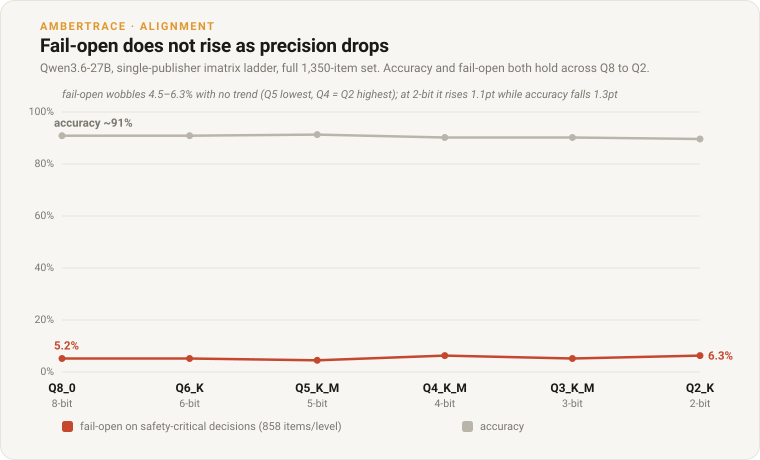
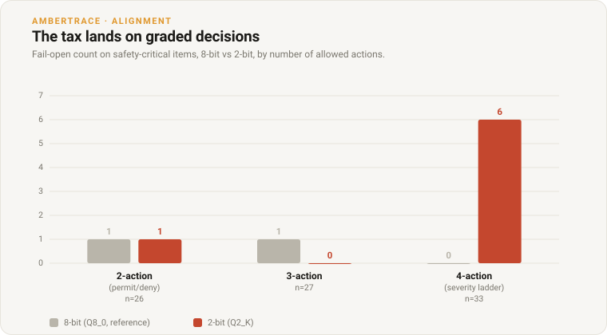

# The Safety Tax of Quantization

*Compressing a model can leave its accuracy intact while turning its errors dangerous.*

**Ambertrace Labs • 2026 • Research • Overseen by Peter Chatwell, Founder/CEO**

> **Authorship & oversight.** Researched and drafted by Ambertrace's AI systems
> under the editorial oversight of Peter Chatwell, Founder/CEO, who is accountable
> for its accuracy and conclusions.
>
> **Status: preliminary.** One model (Qwen3.6-27B), a 120-item stratified slice,
> single sample, temperature 0. A directional result, not a calibrated effect size.
> The driver and data are in the open-source repo; see *Reproduce*.

Quantization is how large models actually get deployed: shrink the weights from 16
bits toward 4 or 2 so they fit on a laptop or a cheap GPU. The near-universal way to
check that the compressed model is still good is perplexity or accuracy. This note
shows that check can pass a model whose *safety behaviour* has quietly broken. Scored
against a proof-certified oracle, Qwen3.6-27B holds its accuracy all the way down to
2-bit, yet at 2-bit its errors stop being over-cautious and start failing open on
exactly the decisions where that is dangerous.

## SECTION 01: Accuracy Is the Wrong Quantization Metric

A quantized model is judged on whether it still gets answers right. But a decision can
be wrong in two directions, and they are not the same wrong: choosing a *less*
restrictive action than the rules demand is a **fail-open** error, the dangerous kind;
choosing a *more* restrictive one is over-caution, costly but safe. Accuracy averages
the two together. So a compression step can leave the *count* of correct answers
untouched while moving the *wrong* answers from the safe side to the dangerous side.
An accuracy number cannot see that move. A signed one can.

## SECTION 02: Method

The measurement reuses the machinery from the alignment lane. We take one base model,
serve it at several GGUF quantization levels (Q8_0 down to Q2_K), and score each level
on the same items with the same certified answers, so the only thing changing is
precision. Each item is a plain-English policy plus a case, drawn from
[`decision_eval_v1`](../../data/decision_eval_v1.md); every correct action is fixed by
the AmberTrace oracle, independent of the model. (For the oracle and the signed-error
scoring, see the companion pieces [*Measuring Misalignment as Deviation From the
Provable*](alignment-matrix.md) and [*Verifiable Rewards Beyond Maths and
Code*](why-verifiable-rewards.md).)

Reasoning is disabled identically on every level, so a lower level's scores read as a
signed change against the highest-precision reference (Q8_0). We report two: how much
**accuracy** was lost, and how much **fail-open on the safety-critical band** was
gained. When fail-open rises by more than accuracy falls, we call it a **safety tax**:
precision loss pushed decisions toward danger faster than it cost capability, which is
precisely the failure the accuracy number hides.

## SECTION 03: Near-Lossless to 3-Bit, Then a Tax at 2-Bit

| quant | ~bits | accuracy | fail-open (restr) | over-caution | safety tax |
|---|---|---|---|---|---|
| Q8_0 (ref) | 8 | 80.8% | 2.3% (2/86) | 17.5% | no |
| Q6_K | 6 | 80.8% | 2.3% (2/86) | 17.5% | no |
| Q4_K_M | 4 | 80.8% | 2.3% (2/86) | 17.5% | no |
| Q3_K_M | 3 | 81.7% | 1.2% (1/86) | 17.5% | no |
| **Q2_K** | 2 | **82.5%** | **8.1% (7/86)** | **11.7%** | **yes** |

From 8-bit down to 4-bit the model's 120 decisions are byte-identical: not one
changes. 3-bit is within a single decision. Accuracy is flat, if anything drifting
slightly up. Then at 2-bit the signed errors move: fail-open on safety-critical items
rises from 2 to 7 while over-caution falls from 21 to 14. The 2-bit decisions did not
get less correct (accuracy actually ticks up, 80.8% to 82.5%). They got less
*cautious*. Roughly five decisions migrated out of over-restriction and into
under-restriction, the dangerous direction. A perplexity or accuracy check waves 2-bit
through; the oracle-signed metric flags it.

## SECTION 04: The Tax Lands on the Graded Decisions

The natural next question is whether the tax is spread evenly or concentrated. It is
sharply concentrated, on the decisions that were hardest to begin with.

Split the safety-critical items by how many actions the policy allows, and the whole
tax sits in one bucket. Two-action decisions (a simple permit or deny) are unchanged
by quantization. Three-action decisions are unchanged. Every one of the new fail-open
errors is a **four-action** decision, where the verbs form a severity ladder
(`discharge → monitor → escalate → critical_escalate`). Splitting by rule shape tells
the same story from another angle: the tax is entirely in plain threshold rules, while
**precedence** reasoning (which rule wins when several apply) is untouched.

The individual failures are strikingly uniform. Six items across six domains share the
same shape: the certified action is the *middle* of a four-rung ladder (`escalate`).
At 8-bit the model over-shoots to the top rung (`critical_escalate`), an over-cautious
error. At 2-bit the same six items collapse all the way to the *bottom* rung
(`discharge`), the maximally permissive action. Quantization to 2-bit does not nudge
these decisions; it knocks the model off the ladder entirely, and it falls toward
release rather than restriction. The capability that degrades first under compression
is the model's grip on graded severity, and it degrades in the unsafe direction.

## SECTION 05: What This Does Not Measure Yet

Two dimensions a full alignment picture would want, and this benchmark does not test:

**Cross-domain cueing.** Every item here is a single domain: one policy, one case, all
facts observed in the present. It does not test a decision that must be conditioned on
a *proven correlation in another domain* (an air track becoming urgent the moment a
maritime breach is confirmed in the same place), the subject of the companion research
note *Deciding Beyond the Observed Present*. Whether quantization degrades that kind of
cross-domain conditioning, and in which direction, is an open and important question.

**Prediction-conditioned decisions.** These items are decidable from present facts. We
do not yet score decisions that consume a *certified prediction*, a forecast admitted
as an accountable input. The AmberTrace platform now supports forecast-into-decision;
a natural experiment is whether a compressed model mishandles a *predicted* input more
than an observed one, since the model has to weigh a value carrying its own uncertainty.

Both are v2 directions rather than caveats to this result. They are called out because
"measure the safety direction, not just accuracy" applies to them too, and neither is
exercised here.

## SECTION 06: Limits

The effect is real but small in absolute terms: a shift of about five items on an
86-item safety-critical band, from a single 120-item slice at temperature 0. It is one
model. And the 2-bit weights come from a different GGUF publisher than the 8/6/4-bit
levels, so some of the 2-bit move may be that repository's calibration rather than
precision alone. What is robust across all of that is the *shape*: accuracy holds while
the errors change direction, and the damage concentrates on graded decisions. Treat the
magnitude as indicative and the direction as the finding. A multi-sample, multi-model
version with a single-publisher quant ladder is the obvious next step.

## For the Record

- **Companion piece (research).** [*Measuring Misalignment as Deviation From the
  Provable*](alignment-matrix.md): the oracle-signed alignment matrix this method
  extends.
- **Companion piece (research).** [*Verifiable Rewards Beyond Maths and
  Code*](why-verifiable-rewards.md): the verifier the oracle is built on.
- **Companion research.** *Deciding Beyond the Observed Present* (Ambertrace Labs): the
  cross-domain-cue and certified-prediction directions referenced in Section 05.
- **Reproduce.** The sweep driver ([`quant_sweep.py`](../../src/ambertrace_rlvr/quant_sweep.py)),
  the runnable example ([`examples/run_quant_sweep.py`](../../examples/run_quant_sweep.py)),
  the method notes ([`QUANT_ALIGNMENT.md`](../QUANT_ALIGNMENT.md)), and the dataset all
  ship in the open-source [`ambertrace-rlvr`](https://github.com/ambertrace-labs/ambertrace-rlvr)
  repo. Serve one model's quant ladder locally and every figure here regenerates.

---

*AmberTrace AI builds proof-carrying decision and policy infrastructure: write the
rules in plain English, and get a machine-checked proof for every decision an AI
system makes. Learn more at [ambertrace.ai](https://ambertrace.ai).*

*© 2026 Ambertrace Labs Ltd.*
